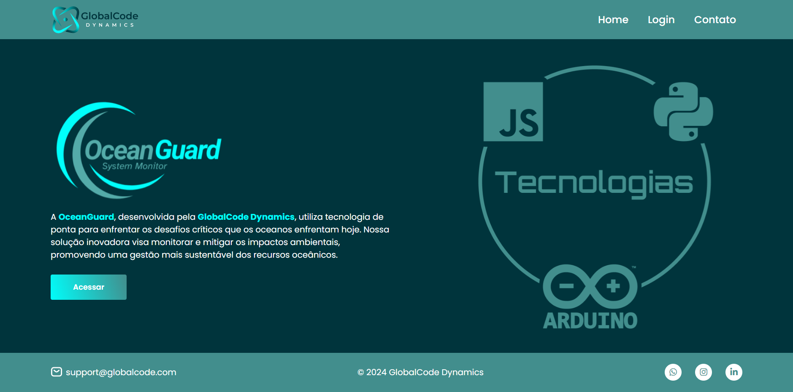

# Sistema Web - OceanGuard

## Sobre
OceanGuard é uma iniciativa inovadora desenvolvida pela GlobalCode Dynamics, dedicada a promover a sustentabilidade e a conservação dos oceanos. Nosso projeto visa enfrentar os desafios ambientais críticos que os oceanos estão enfrentando, utilizando tecnologia avançada para monitoramento, análise de dados, educação e engajamento comunitário.

## Links

- [Figma](https://www.figma.com/design/MQZqXY0fxMYFKnt0fC6C62/GS---OceanGuard---WebDev?node-id=0-1&t=u9Ur9Yay66VSbfr3-1)
- [Deploy](https://luyz-gusta.github.io/OceanGuard/)

## Desenvolvedores
| Desenvolvedor | Avatar | RM |
| ------------- | ------ | -- |
|  |  | RM556790 |
|  |  | RM558358 |
|  |  | RM557531 |

